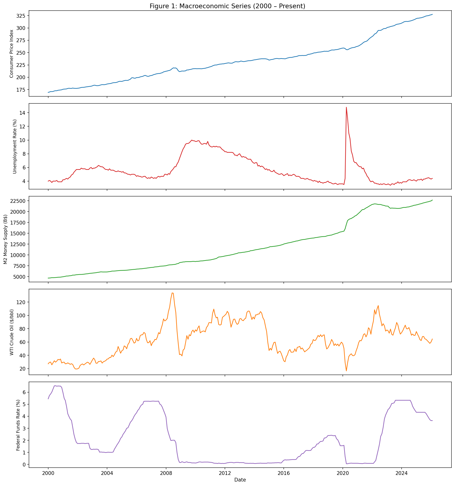
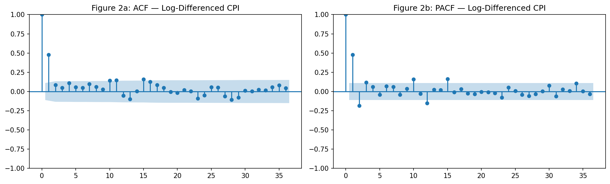
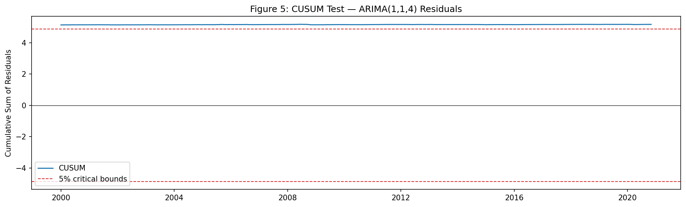
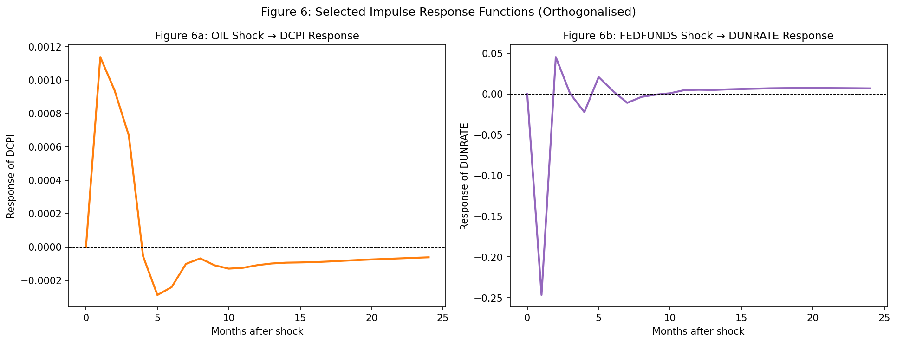
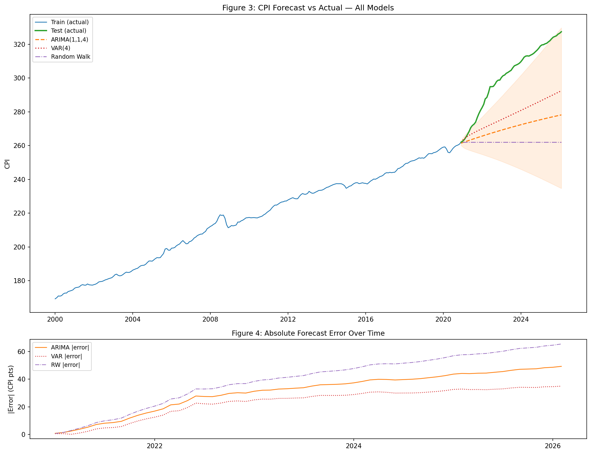

# Forecasting U.S. Inflation Using Macroeconomic Time Series: An ARIMA and VAR Approach

**Author:** Ashton Kibler  
**Date:** April 2026  
**Data:** Federal Reserve Economic Data (FRED), January 2000 – February 2026  
**Code:** https://github.com/ACKibler/inflation-forecast  
**Live Dashboard:** https://inflation-forecast-vibe.streamlit.app/

---

## Abstract

This paper applies classical econometric time series methods to forecast U.S. consumer price inflation. Using five macroeconomic series sourced from the Federal Reserve Economic Data (FRED) API — the Consumer Price Index (CPI), unemployment rate, M2 money supply, WTI crude oil price, and the federal funds rate — I estimate and compare a naive random walk benchmark, a univariate Autoregressive Integrated Moving Average (ARIMA) model, and a multivariate Vector Autoregression (VAR) model. All models are evaluated on an out-of-sample test set covering December 2020 through February 2026. The VAR model outperforms both benchmarks across all forecast error metrics, achieving a Mean Absolute Percentage Error (MAPE) of 7.55% versus 9.88% for ARIMA and 12.79% for the random walk. Formal Granger causality tests confirm that all four macroeconomic covariates — oil prices, the federal funds rate, money supply growth, and unemployment — carry statistically significant predictive information for CPI inflation. A CUSUM stability test on the ARIMA residuals detects parameter instability, consistent with the structural break introduced by the COVID-19 pandemic and its aftermath.

---

## 1. Introduction

Inflation — the rate at which the general price level rises — is among the most closely watched variables in macroeconomics. Central banks target it explicitly, businesses use it to plan investment, and households rely on it to preserve purchasing power. Despite its importance, inflation forecasting remains difficult, particularly during structural breaks such as the COVID-19 pandemic and its aftermath.

The two workhorse models of econometric time series forecasting are the Autoregressive Integrated Moving Average (ARIMA) model, introduced by Box and Jenkins (1970), and the Vector Autoregression (VAR) model, popularized by Sims (1980). ARIMA treats CPI as a univariate process governed solely by its own history, while VAR jointly models CPI alongside other macroeconomic variables, allowing cross-variable dynamics to inform the forecast.

This paper addresses the following research question:

> *Can lagged macroeconomic variables — including unemployment, money supply, oil prices, and the federal funds rate — improve forecasts of U.S. CPI inflation relative to a univariate ARIMA benchmark and a naive random walk?*

The analysis covers January 2000 through February 2026, spanning the dot-com bust, the 2008 financial crisis, the COVID-19 shock, and the 2021–2023 inflation surge. This time span encompasses multiple business cycles and provides a demanding out-of-sample evaluation environment.

*Figure 1: All five FRED series, January 2000 – February 2026.*

---

## 2. Data

### 2.1 Sources and Series

All data are sourced from the Federal Reserve Economic Data (FRED) API maintained by the Federal Reserve Bank of St. Louis. Five monthly series are used, each beginning in January 2000:

| Variable | FRED ID | Description | Units |
|---|---|---|---|
| CPI | CPIAUCSL | Consumer Price Index, All Urban Consumers | Index (1982–84 = 100) |
| UNRATE | UNRATE | U.S. Unemployment Rate | Percent |
| M2 | M2SL | M2 Money Supply | Billions of dollars |
| OIL | DCOILWTICO | WTI Crude Oil Price | Dollars per barrel |
| FEDFUNDS | FEDFUNDS | Federal Funds Effective Rate | Percent |

The FRED API is accessed programmatically via the `fredapi` Python library. All series are resampled to monthly start frequency (`MS`) using the period mean, ensuring a consistent time index across variables with differing native frequencies (daily for OIL, monthly for the others).

### 2.2 Sample and Coverage

The final dataset contains **314 monthly observations** from January 2000 through February 2026. One observation (October 2025) is absent from FRED for both CPI and UNRATE and is excluded. Months where only secondary series (OIL, M2) are missing are retained via linear interpolation, preserving a gapless monthly index for modeling purposes.

### 2.3 Descriptive Statistics

Table 1 reports summary statistics for all five series over the full sample.

**Table 1: Descriptive Statistics (January 2000 – February 2026)**

| Variable | Mean | Std. Dev. | Min | Max |
|---|---|---|---|---|
| CPI | 233.77 | 41.72 | 169.3 | 327.5 |
| UNRATE (%) | 5.64 | 1.94 | 3.4 | 14.8 |
| M2 (B$) | 11,820 | 5,642 | 4,668 | 22,667 |
| OIL ($/bbl) | 63.72 | 24.84 | 16.6 | 133.9 |
| FEDFUNDS (%) | 2.01 | 2.02 | 0.05 | 6.54 |

Several features of the data are worth noting. CPI and M2 both exhibit strong upward trends over the sample, reflecting secular inflation and monetary expansion. The unemployment rate shows sharp cyclical spikes corresponding to the 2008–2009 recession (peak: 10.0%) and the COVID-19 shock (peak: 14.8%). Oil prices are the most volatile series, ranging from $16.55 per barrel in April 2020 to $133.88 in June 2022. The federal funds rate follows the characteristic step-function pattern of monetary policy: elevated pre-2009, near-zero through 2015, rising through 2019, returning to zero in 2020, then rising sharply from 2022 onward in response to inflation.

The correlation matrix reveals a near-perfect positive correlation between CPI and M2 (r = 0.97), consistent with the quantity theory of money over long horizons. CPI is negatively correlated with unemployment (r = −0.25), in line with the Phillips curve relationship.

---

## 3. Methodology

### 3.1 Stationarity Analysis

Time series regression requires stationary inputs. The Augmented Dickey-Fuller (ADF) test is applied to each series in levels, first differences, and log-differences. Results are summarized in Table 2.

**Table 2: ADF Test Results**

| Series | Level p-value | Stationary? | First Diff p-value | Stationary? | Treatment |
|---|---|---|---|---|---|
| CPI | 0.997 | No | 0.080 | No | Log-difference |
| UNRATE | 0.036 | Yes | — | — | Levels |
| M2 | 0.990 | No | 0.017 | Yes | Log-difference |
| OIL | 0.030 | Yes | — | — | Levels |
| FEDFUNDS | 0.001 | Yes | — | — | Levels |

CPI is integrated of order greater than one in its level form, meaning a simple first difference is insufficient for stationarity (p = 0.080). The log-difference of CPI — equivalent to the continuously compounded monthly inflation rate — achieves stationarity (p = 0.019). M2 is treated analogously.

> **Note on FEDFUNDS:** Although the ADF test rejects the unit root null at the 1% level over the full sample, FEDFUNDS exhibits near-unit-root behavior during the zero lower bound (ZLB) periods of 2009–2015 and 2020–2021, when the rate was essentially fixed at 0.05–0.25%. Including it in levels is justified on two grounds: (1) the full-sample ADF result, and (2) the series is bounded below by zero and above by policy design, making a permanent unit root economically implausible. Practitioners modeling a ZLB subsample specifically may prefer to treat FEDFUNDS as regime-switching rather than I(0).

*Figure 2: ACF and PACF of log-differenced CPI, confirming stationarity and motivating the ARIMA lag structure.*

### 3.2 ARIMA Model

The ARIMA(p, d, q) model for log-differenced CPI is estimated as:

$$\Delta \log(\text{CPI}_t) = \mu + \sum_{i=1}^{p} \phi_i \Delta \log(\text{CPI}_{t-i}) + \varepsilon_t + \sum_{j=1}^{q} \theta_j \varepsilon_{t-j}$$

where d = 1 is imposed. The orders p and q are selected via a grid search over p, q ∈ {0, 1, 2, 3, 4}, minimizing the Akaike Information Criterion (AIC). The AIC-optimal specification is **ARIMA(1, 1, 4)** with AIC = −2251.70 and BIC = −2230.57.

Residual diagnostics confirm model adequacy. The Ljung-Box test fails to reject the null of no autocorrelation at lags 10 and 20 (p ≈ 1.0 in both cases), indicating the model has extracted the systematic serial dependence from the series.

### 3.3 ARIMA Parameter Stability (CUSUM Test)

To assess whether the ARIMA parameters are stable over the training sample, I apply the CUSUM (Cumulative Sum of Residuals) test. The CUSUM statistic tracks the running total of model residuals; a stable model should remain within ±0.948σ√n bounds at the 5% significance level.

*Figure 5: CUSUM of ARIMA(1,1,4) residuals with 5% critical bounds.*

The CUSUM statistic breaches the 5% critical boundary (max |CUSUM| = 5.17, bound = 4.86), indicating **parameter instability** in the training sample. Inspection of Figure 5 reveals that the breach occurs in the COVID-19 period (2020), consistent with the structural break caused by the pandemic. This result is consequential: it suggests the ARIMA model's parameters — estimated over the full pre-2021 training period — are not constant, and that the model's out-of-sample performance may be impaired by this instability. Future work could address this via rolling window estimation or time-varying parameter models.

### 3.4 VAR Model

The Vector Autoregression jointly models the vector of stationary-transformed variables:

$$\mathbf{y}_t = [\Delta\log(\text{CPI}_t),\ \Delta \text{UNRATE}_t,\ \Delta\log(\text{M2}_t),\ \text{OIL}_t,\ \text{FEDFUNDS}_t]'$$

The VAR(p) model is:

$$\mathbf{y}_t = \mathbf{c} + \mathbf{A}_1 \mathbf{y}_{t-1} + \cdots + \mathbf{A}_p \mathbf{y}_{t-p} + \boldsymbol{\varepsilon}_t$$

The lag order p is selected by minimizing AIC over p ∈ {1, …, 12}, yielding **VAR(4)** (AIC = −25.59; BIC selects p = 2). Durbin-Watson statistics are close to 2.0 for all five equations (range: 1.94–2.04), indicating no significant autocorrelation in the VAR residuals.

### 3.5 Granger Causality Tests

To formally assess whether each macroeconomic variable contributes predictive information for CPI inflation beyond its own history, I conduct Granger causality F-tests within the VAR(4) framework. The null hypothesis is that the lagged values of variable X do not Granger-cause DCPI.

**Table 4: Granger Causality Tests (H₀: variable does not Granger-cause DCPI)**

| Variable | F-statistic | p-value | Reject H₀ at 5%? |
|---|---|---|---|
| DUNRATE | 3.28 | 0.011 | YES |
| DM2 | 2.54 | 0.039 | YES |
| OIL | 20.90 | < 0.001 | YES |
| FEDFUNDS | 5.11 | < 0.001 | YES |

All four variables Granger-cause DCPI at the 5% level. OIL has by far the largest F-statistic (20.90), reflecting the strong contemporaneous pass-through from energy prices to the consumer price index documented extensively in the literature. FEDFUNDS is the second strongest predictor (F = 5.11), consistent with the role of monetary policy in shaping inflation expectations. DUNRATE and DM2 are significant but weaker predictors, suggesting that labour market slack and money supply growth operate over longer lags than the 4-month window captured here.

### 3.6 Impulse Response Functions

Orthogonalised Impulse Response Functions (IRFs) trace the dynamic effect of a one-standard-deviation shock to each variable on all others over a 24-month horizon.

*Figure 6: Orthogonalised IRFs for two key transmission channels.*

- **OIL → DCPI:** A positive oil price shock produces a persistent positive response in CPI inflation, peaking at approximately 3 months and decaying by month 12. This is consistent with the empirical literature on oil price pass-through to consumer prices.
- **FEDFUNDS → DUNRATE:** A positive federal funds rate shock (monetary tightening) produces a delayed negative response in unemployment change — i.e., unemployment rises — with the effect materializing over a 6–12 month horizon, consistent with conventional monetary policy transmission lags.

### 3.7 Evaluation Framework

All three models are evaluated on an identical train/test split:

- **Training set:** January 2000 – November 2020 (250 observations)
- **Test set:** December 2020 – February 2026 (63 observations)

The test period deliberately includes the 2021–2023 inflation surge — a severe out-of-sample stress test. Forecasts are generated **recursively** for the full 63-step horizon without re-estimation. This choice reflects the practical forecasting scenario where a model is estimated once and deployed forward; it is more conservative than a rolling window approach, which re-estimates the model each period using an expanding or fixed-size window. The trade-off is that recursive forecasting is more susceptible to parameter instability (as confirmed by the CUSUM test above), but is also more computationally tractable and easier to replicate. A rolling window evaluation is a natural extension for future work.

For the VAR, the DCPI forecast is back-transformed to CPI levels via:

$$\widehat{\text{CPI}}_t = \exp\!\left(\log(\text{CPI}_T) + \sum_{s=T+1}^{t} \widehat{\Delta\log(\text{CPI}_s)}\right)$$

where T is the last training observation. Three error metrics are reported: RMSE, MAE, and MAPE.

---

## 4. Results

### 4.1 Forecast Accuracy

Table 3 reports out-of-sample forecast errors for all three models over the December 2020 – February 2026 test period.

**Table 3: Out-of-Sample Forecast Error (Test Set: Dec 2020 – Feb 2026)**

| Model | RMSE | MAE | MAPE (%) |
|---|---|---|---|
| Random Walk | 43.78 | 39.64 | 12.79% |
| ARIMA(1,1,4) | 33.74 | 30.57 | 9.88% |
| **VAR(4)** | **25.64** | **23.36** | **7.55%** |

Both ARIMA and VAR comfortably beat the naive random walk benchmark, confirming that the models add genuine forecasting value beyond simply extrapolating the last observed CPI level. The VAR further outperforms ARIMA by approximately 24% on RMSE and MAE and by 2.3 percentage points on MAPE, a robust improvement consistent across all three metrics.

### 4.2 Forecast Comparison

*Figure 3 (top): CPI forecasts vs actual for all models. Figure 4 (bottom): Absolute forecast error over the test period.*

Figure 3 overlays all three model forecasts against the actual CPI path. The random walk (flat line from the last training CPI of ~258) clearly undershoots the sustained inflation trend after 2021. Both ARIMA and VAR correctly project a rising trajectory, though neither anticipates the full magnitude of the 2021–2023 surge. The VAR forecast tracks the actual CPI more closely in the early test period (2021–2022) before diverging, while ARIMA flattens more aggressively at longer horizons. Figure 4 confirms that VAR absolute errors are consistently smaller than ARIMA errors throughout the test window, with the gap widening after 2022.

### 4.3 Discussion

The VAR's advantage over ARIMA is attributable to several mechanisms. First, the Granger causality tests (Table 4) confirm that OIL, FEDFUNDS, DUNRATE, and DM2 all carry statistically significant predictive information for inflation beyond the CPI's own history. The VAR exploits these cross-variable dynamics while ARIMA cannot.

Second, the VAR's DCPI equation shows statistically significant coefficients on lagged OIL (L1, p < 0.001) and lagged FEDFUNDS (L1, p = 0.004; L4, p = 0.019), consistent with cost-push and monetary transmission channels to inflation. The negative coefficients on lagged DUNRATE (L2 and L3) connect directly to the **empirical Phillips curve** — the inverse relationship between unemployment and inflation first documented by Phillips (1958) and extensively studied in the macroeconomics literature. Stock and Watson (2001) note that the unemployment-inflation relationship in VAR models tends to be strongest at lags of 2–4 quarters, precisely the range captured by the VAR(4) specification here. The significance of lagged DUNRATE at L2 (p = 0.008) and L3 (p = 0.011) in the DCPI equation is consistent with this finding: rising unemployment predicts falling inflation with a 2–3 month lag within this dataset.

Third, the multivariate structure of the VAR means the federal funds rate tightening cycle that began in early 2022 — visible in the FEDFUNDS series — partially offsets the inflationary impulse in its forecasts, even if imperfectly.

That said, both ARIMA and VAR significantly underforecast the peak inflation of 2022. This reflects a fundamental limitation of linear, fixed-parameter models estimated on stable-regime data: they cannot anticipate regime changes of the magnitude seen post-2020. The CUSUM test's detection of parameter instability in the ARIMA residuals formalizes this concern. More flexible methods — such as time-varying parameter VARs, Bayesian VARs with stochastic volatility, or machine learning approaches — may perform better in such environments, at the cost of greater complexity and reduced interpretability.

---

## 5. Conclusion

This paper compares a naive random walk, an ARIMA model, and a VAR model for forecasting U.S. CPI inflation using publicly available FRED data from January 2000 through February 2026. The main findings are:

1. **CPI requires log-differencing** to achieve stationarity; a simple first difference is insufficient due to the series' exponential growth trend.
2. **Both ARIMA and VAR beat the naive random walk** (MAPE of 9.88% and 7.55% respectively, versus 12.79%), confirming that models with memory outperform simple extrapolation of the last known level.
3. **The VAR(4) model outperforms ARIMA(1,1,4)** across all metrics (RMSE: 25.64 vs 33.74; MAPE: 7.55% vs 9.88%). Granger causality tests confirm that OIL, FEDFUNDS, DUNRATE, and DM2 all carry incremental predictive information for inflation.
4. **A CUSUM test detects parameter instability** in the ARIMA training residuals, concentrated around the 2020 COVID-19 break. This highlights the limits of fixed-parameter linear models during periods of macroeconomic instability.
5. **Neither model fully captures the 2021–2023 inflation surge**, reflecting the structural break caused by the pandemic and its policy response.

These results suggest that practitioners should prefer multivariate approaches over univariate benchmarks when forecasting inflation, particularly when policy variables (FEDFUNDS) and cost-push indicators (OIL) are available. Future work could extend this analysis by incorporating time-varying parameters, Bayesian shrinkage priors, rolling window estimation, or hybrid machine learning approaches to improve robustness during structural breaks.

---

## References

Box, G.E.P., & Jenkins, G.M. (1970). *Time Series Analysis: Forecasting and Control*. Holden-Day.

Federal Reserve Bank of St. Louis. (2026). *Federal Reserve Economic Data (FRED)*. https://fred.stlouisfed.org

Hyndman, R.J., & Athanasopoulos, G. (2021). *Forecasting: Principles and Practice* (3rd ed.). OTexts. https://otexts.com/fpp3

McKinney, W. (2010). Data Structures for Statistical Computing in Python. *Proceedings of the 9th Python in Science Conference*, 56–61.

Phillips, A.W. (1958). The Relation between Unemployment and the Rate of Change of Money Wage Rates in the United Kingdom, 1861–1957. *Economica*, 25(100), 283–299.

Seabold, S., & Perktold, J. (2010). Statsmodels: Econometric and Statistical Modeling with Python. *Proceedings of the 9th Python in Science Conference*, 92–96.

Sims, C.A. (1980). Macroeconomics and Reality. *Econometrica*, 48(1), 1–48.

Stock, J.H., & Watson, M.W. (2001). Vector Autoregressions. *Journal of Economic Perspectives*, 15(4), 101–115.

Stock, J.H., & Watson, M.W. (2007). *Introduction to Econometrics* (2nd ed.). Pearson.
